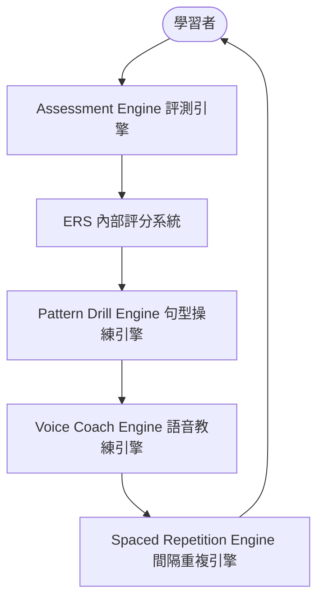
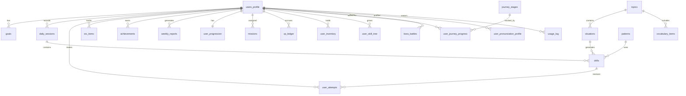

# 系統架構與設計 (Architecture)

本文件說明 **English Reflex Coach** 的技術棧、核心學習引擎架構以及通用等級系統的設計。

## 🛠 技術棧 (Tech Stack)

本專案全面使用現代雲端與 AI 基礎設施：

- **前端框架**: Next.js (Vercel 託管)
- **後端與資料庫**: Supabase (PostgreSQL 關聯式資料庫)
- **身分驗證**: Supabase Auth
- **AI 引擎**: OpenAI API (用於生成句型操練、分析等)
- **語音互動**: OpenAI Realtime API (支援極低延遲的雙向語音對話)
- **部署平台**: Vercel

---

## ⚙️ 學習框架：核心引擎 (Learning Framework)

平台的核心邏輯由以下八大引擎共同驅動：

### 1. 句型操練引擎 (Pattern Drill Engine)
- 每一課皆圍繞一個**核心句型 (Core Pattern)**。
- 透過 AI 動態生成 4 種操練類型，訓練學習者的語感反射：
  1. **替換操練 (Substitution)**：替換句子中的特定單字。
  2. **轉換操練 (Transformation)**：句型句式轉換（例如：主動變被動、肯定變否定、現在式變過去式）。
  3. **擴展操練 (Expansion)**：逐步增加子句或形容詞修飾。
  4. **情境反應 (Situational Reaction)**：模擬真實情境快速口頭回答。

### 2. 間隔重複引擎 (Spaced Repetition Engine)
- **自適應間隔重複系統 (SRS)**：追蹤單字、句型與口語回答表現，預設採用 Day 1 至 Day 120 的排程週期。
- **強化複習循環 (Intensive Review Loop)**：若回答錯誤或反應遲緩，項目將被降級並拉回當前 Session 與隔天再次複習。
- **狀態與評分機制**：定義 `New`、`Learning`、`Weak`、`Mastered` 四種項目狀態，並維護 `0–100` 的掌握度分數（綜合準確率、反應速度、自信度、發音與記憶留存率）。
- **複習優先權與配比**：以 `Weak` 項目為最高優先，並提供每日新舊內容配比的動態調節機制（若 Weak 項目過多會自動減少新內容載入）。

### 3. 語音教練引擎 (Voice Coach Engine)
- 提供語音優先 (Voice-First) 的學習體驗，支援語音轉文字 (STT)、AI 發音評估、文字轉語音 (TTS) 以及即時雙向語音對話 (OpenAI Realtime API)。
- 內建**跟讀練習模式 (Shadowing Practice Mode)**，可進行「AI 朗讀 $\rightarrow$ 學習者複誦 $\rightarrow$ 系統評估發音、流暢度與語速節奏 $\rightarrow$ 銜接句型操練」的完整閉環。
- 支援多種 **AI 教練風格切換**（親切、嚴厲、考官、CIA 特工教官、熱血）。

### 4. 評測引擎 (Assessment Engine)
- 負責入學測試 (Placement Test) 與日常能力評估，分析詞彙、句型運用、聽力、口語與反應速度，並產出對應的 ERS 分數。
- 驅動 **AI 學習分析師 (AI Learning Analyst)** 每週產生學習分析報告，給予個人化的強弱項訓練建議。

### 5. 成就時間軸引擎 (Achievement Timeline Engine)
- 將學習者的歷史紀錄（如等級進展、單字與句型掌握數、口說突破、練習時數等）轉化為可視化的「成長故事」時間軸。
- 提供**每週 AI 自省與反饋 (Weekly AI Reflections)**，自動生成文字總結學習表現。
- 依據實際學習速度，動態生成**未來里程碑預測時間線 (Future Projection)**。

### 6. 學習智能引擎 (Learning Intelligence Engine)
- **AI 記憶檔案 (AI Memory Profile)**：建立長期學習特徵檔案，分析學習風格、強弱項、偏好主題、反應特徵（如：說話快但反應慢、思考謹慎但反應慢等）、自信度與口說習慣。
- **錯誤模式引擎 (Error Pattern Engine)**：建立錯誤模式資料庫，分析「答錯的原因」（如：常漏掉冠詞 a/an/the、常遺忘過去式、介係詞漏失、迴避長句、because 因果子句失敗、語序錯誤、說話前遲疑過久等）。
- **技能拆解引擎 (Skill Breakdown Engine)**：多維度追蹤字彙、文法、口說、聽力、反應速度、發音、流暢度各別的 CLB 等級，呈現整體等級與個別技能樹。
- **AI 任務生成器 (AI Mission Generator)**：依據當前等級、弱點、學習目標與考試排程，動態生成自適應任務（如：50 次弱點情境操練、20 次快速反應操練、字彙複習等）。
- **未來路線圖預測引擎 (Future Roadmap Engine)**：預測 30/90/180 天的 CLB 成長，並提供「學習時長模擬 (Scenario Simulation)」（如 30/45/60 分鐘的成效對比、節省時間與動力激勵分析）。

### 7. 遊戲化與留存引擎 (Gamification & Retention Engine)
- **世界觀框架 (CIA English Academy)**：將學習者定位為受訓特工，所有學習行為以任務 (Mission) 與挑戰 (Challenge) 包裝。
- **雙軌進度系統 (Dual Progression)**：維護彼此獨立的「語言等級 (ERS/CLB)」與「特工等級 (Agent Level / XP)」，前者記於 `users_profile`，後者記於 `user_progression`。
- **XP 與軍階 (XP & Ranks)**：依學習行為給予 XP，驅動 8 階軍階晉升 (Recruit → Legend Agent)。
- **動態任務與獎勵 (Missions & Rewards)**：每日/每週/每月自適應任務、每日獎勵寶箱、道具代幣與雙倍 XP 加成。
- **連續打卡 (Streak)**：追蹤連續學習天數並提供護盾保護機制。
- **冒險化呈現 (Adventure Layer)**：世界地圖關卡 (Journey Map)、RPG 技能樹 (Skill Tree)、每週王者挑戰 (Boss Battle，AI 扮演 NPC)。
- **留存迴圈 (Habit Loop)**：登入 → 任務 → XP → 寶箱 → 升級 → 解鎖 → 進度 → 隔日回訪。
- 詳細規格參見 [核心功能：§7 遊戲化與留存系統](./features.md#-7-遊戲化與留存系統-gamification--retention-system)。

### 8. 進階語言習得引擎 (Advanced Language Acquisition Engine)
吸收 FSI / 情報機構語言訓練、句型操練法與認知科學的升級核心,將「自然反射溝通」拆解為可量測、可訓練的維度:
- **反應速度引擎 (Reaction Speed Engine)**：量測回應延遲、思考時間與開口起始速度，直接影響 ERS / CLB / 週報 / 成就。
- **發音實驗室 (Pronunciation Lab)**：最小對立對 (Minimal Pairs)、跟讀 (Shadowing)、發音挑戰，並建立個人化「易混淆音檔案 (Sound Confusion Profile)」。
- **頻率引擎 (Frequency Engine)**：每個單字帶有頻率分數 (Very Common / Common / Uncommon / Rare)，依真實溝通實用性決定學習優先級。
- **自然度引擎 (Naturalness Engine)**：分開評估文法正確度、自然度、母語近似度三項分數。
- **文化校準引擎 (Cultural Calibration Engine)**：依目標區域 (Canada / US / UK / Australia / International) 給予文化得體性回饋。
- **溝通風格引擎 (Communication Style Engine)**：追蹤禮貌度、直接度、自信度、專業度、友善度、同理心。
- **英語反射發展模型 (English Reflex Development Model)**：以 8 大維度 (詞彙 / 文法 / 流暢度 / 發音 / 反應速度 / 自然度 / 溝通風格 / 記憶留存) 綜合評估，餵入 ERS、CLB 估算、未來預測、週報與任務生成。
- 詳細規格參見 [核心功能：§10 進階語言習得引擎](./features.md#-10-進階語言習得引擎-advanced-language-acquisition-engine)。

---

## 📊 通用等級系統 (Universal Level System)

為了解決不同英文檢定分數不一的問題，平台設計了一套統一的內部評分指標：

### 英語反射分數 (English Reflex Score - ERS)
- **分數範圍**：`0 – 1200` 分。
- **評分維度與權重（English Reflex Development Model 八維加權）**：
  ERS 由八大維度加權計算所得（各維度皆須先正規化至 `0–1200`），權重總和為 `1.00`：

  $$\text{ERS} = \sum_{i=1}^{8} w_i \cdot D_i$$

| 維度 (Dimension) | 權重 $w_i$ | 設計理由 |
| :--- | :---: | :--- |
| 文法／句型 (Grammar/Pattern) | `0.18` | 句型操練核心基礎 |
| 詞彙 (Vocabulary) | `0.15` | 表達廣度基礎 |
| 流暢度 (Fluency) | `0.15` | 連貫不結巴 |
| 反應速度 (Reaction Speed) | `0.15` | **反射訓練核心差異化指標** |
| 自然度 (Naturalness) | `0.12` | **道地、非翻譯腔的關鍵** |
| 發音 (Pronunciation) | `0.10` | 聽辨與口說準確度 |
| 溝通風格 (Communication Style) | `0.08` | 得體性與文化校準 |
| 記憶留存 (Retention) | `0.07` | 長期掌握穩定度（非單次表現） |
| **合計 (Total)** | **`1.00`** | |

  - **產品哲學對齊**：反應速度 + 自然度 + 溝通風格三項「反射／道地」差異化維度合計 `0.35`，與「English Reflex Coach」定位一致；文法／詞彙／流暢度／發音四項語言基礎合計 `0.58`；記憶留存 `0.07` 確保分數反映長期掌握而非臨場運氣。
  - **各維度資料來源**：前五維來自 `user_attempts` 之即時評分；自然度與溝通風格來自 [自然度與文化校準提示詞](#6-自然度與文化校準提示詞-naturalness--cultural-calibration-prompt)（`naturalness_score`、`communication_style`）；記憶留存來自 `srs_items.mastery_score` 之加權平均。

- **反應速度評分標準 (Reaction Speed Score)**：
  - `Excellent` (優秀)：回答時間 < 1.5 秒
  - `Good` (良好)：1.5 – 3 秒
  - `Learning` (學習中)：3 – 6 秒
  - `Weak` (虛弱)：6 秒以上
  - `Failed` (失敗)：無回答
- **CLB 等級轉換映射表**：
  使用者可自由選擇將內部 ERS 分數轉換為對應之主流檢定指標（如 CLB, IELTS, CEFR, TOEIC, TOEFL, PTE, DET）。
  ERS 與 **CLB** 的映射區間如下：
  * **CLB 1**: ERS 0–99
  * **CLB 2**: ERS 100–199
  * **CLB 3**: ERS 200–299
  * **CLB 4**: ERS 300–399
  * **CLB 5**: ERS 400–499
  * **CLB 6**: ERS 500–599
  * **CLB 7**: ERS 600–699
  * **CLB 8**: ERS 700–799
  * **CLB 9**: ERS 800–899
  * **CLB 10**: ERS 900–999
  * **CLB 11**: ERS 1000–1099
  * **CLB 12**: ERS 1100–1200

---

## 🗄 Supabase 資料庫結構 (Database Schema)

專案在 Supabase PostgreSQL 中設計了以下核心資料表：

### 1. users_profile (使用者基本資料)
- `id` (uuid, PK)
- `user_id` (uuid, FK to auth.users)
- `display_name` (text)
- `preferred_language` (text) - 偏好引導語系 (預設 `zh-TW`)
- `guidance_mode` (text) - 引導模式 (`A`: 母語, `B`: 混合, `C`: 全英)
- `current_ers` (int4) - 當前 ERS 分數
- `current_clb` (int4) - 當前 CLB 等級
- `target_system` (text) - 目標檢定類別 (如 `CELPIP`, `IELTS`)
- `target_level` (text) - 目標分數等級
- `target_region` (text) - 目標區域語言檔案 (`CA` / `US` / `UK` / `AU` / `INTL`)，供文化校準引擎使用 (預設 `CA`)
- `daily_study_minutes` (int4) - 每日計畫學習分鐘數
- `estimated_completion_date` (date) - 預計達標日期
- `created_at` (timestamptz)
- `updated_at` (timestamptz)

### 2. goals (使用者學習目標權重)
- `id` (uuid, PK)
- `user_id` (uuid, FK)
- `goal_type` (text) - 目標類型 (如 `CELPIP_Immigration`, `IELTS`, `TOEIC`)
- `goal_value` (text) - 具體目標分數
- `weight` (numeric) - 計算後的權重佔比 (多目標時正規化至 100%)
- `created_at` (timestamptz)

### 3. topics (主題池)
- `id` (uuid, PK)
- `title_en` (text)
- `title_zh` (text)
- `description_en` (text)
- `description_zh` (text)
- `category` (text) - 如 `Housing`, `Travel`, `Career`
- `is_active` (boolean)
- `created_at` (timestamptz)

### 4. situations (情境庫)
- `id` (uuid, PK)
- `topic_id` (uuid, FK)
- `title_en` (text)
- `title_zh` (text)
- `description_en` (text)
- `description_zh` (text)
- `suggested_clb_min` (int4)
- `suggested_clb_max` (int4)
- `is_active` (boolean)
- `created_at` (timestamptz)

### 5. patterns (核心句型庫)
- `id` (uuid, PK)
- `pattern_text` (text) - 例如 `I am looking for ___`
- `description_en` (text)
- `description_zh` (text)
- `clb_min` (int4)
- `clb_max` (int4)
- `pattern_type` (text)
- `is_active` (boolean)
- `created_at` (timestamptz)

### 6. vocabulary_items (單字庫)
- `id` (uuid, PK)
- `word` (text)
- `simple_definition_en` (text) - 簡化英文解釋
- `example_sentence_en` (text) - 英文例句
- `topic_id` (uuid, FK)
- `clb_level` (int4)
- `frequency_score` (int4) - 詞頻分數 (供頻率引擎排序學習優先級)
- `frequency_tier` (text) - 頻率分級 (`very_common` / `common` / `uncommon` / `rare`)
- `created_at` (timestamptz)

### 7. daily_sessions (每日學習紀錄)
- `id` (uuid, PK)
- `user_id` (uuid, FK)
- `session_date` (date)
- `planned_minutes` (int4)
- `actual_minutes` (int4)
- `drills_completed` (int4)
- `ers_before` (int4)
- `ers_after` (int4)
- `completed` (boolean)
- `created_at` (timestamptz)

### 8. drills (操練實例紀錄)
- `id` (uuid, PK)
- `user_id` (uuid, FK)
- `session_id` (uuid, FK)
- `topic_id` (uuid, FK)
- `situation_id` (uuid, FK)
- `pattern_id` (uuid, FK)
- `drill_type` (text) - `Substitution`, `Transformation`, `Expansion`, `Situational`
- `prompt` (text) - AI 提示字句
- `expected_answer` (text) - 預期回覆參考
- `created_at` (timestamptz)

### 9. user_attempts (使用者作答紀錄)
- `id` (uuid, PK)
- `user_id` (uuid, FK)
- `drill_id` (uuid, FK)
- `response_text` (text) - 口說識別後文字
- `is_correct` (boolean)
- `accuracy_score` (int4) - 準確度 (0-100)
- `grammar_score` (int4) - 文法 (0-100)
- `fluency_score` (int4) - 流暢度 (0-100)
- `pronunciation_score` (int4) - 發音 (0-100)
- `reaction_time_seconds` (numeric) - 反應時間 (秒)
- `reaction_tier` (text) - 反應速度分級 (`Excellent` / `Good` / `Learning` / `Weak` / `No_Response`)
- `naturalness_score` (int4) - 自然度 (0-100，進階引擎)
- `native_likeness_score` (int4) - 母語近似度 (0-100，進階引擎)
- `communication_style` (jsonb) - 溝通風格六維評分 (politeness / directness / confidence / professionalism / friendliness / empathy)
- `cultural_feedback` (text) - 文化校準引擎依 `target_region` 給予之得體性建議
- `feedback` (text) - 系統/AI 糾錯建議
- `created_at` (timestamptz)

### 10. srs_items (SRS 記憶庫狀態追蹤)
- `id` (uuid, PK)
- `user_id` (uuid, FK)
- `item_type` (text) - `vocabulary` / `pattern` / `speaking_response`
- `item_ref_id` (uuid) - 指向對應單字、句型或作答之 ID
- `status` (text) - `New` / `Learning` / `Weak` / `Mastered`
- `mastery_score` (int4) - 掌握度分數 (0-100)
- `mistake_count` (int4) - 累計答錯次數
- `last_seen` (timestamptz) - 上次學習時間
- `next_review` (timestamptz) - 下次應複習時間
- `review_interval_days` (numeric) - 當前複習間隔天數
- `created_at` (timestamptz)
- `updated_at` (timestamptz)

### 11. achievements (成就解鎖紀錄)
- `id` (uuid, PK)
- `user_id` (uuid, FK)
- `achievement_type` (text) - 如 `Badge`, `Rank`
- `title_en` (text)
- `title_zh` (text)
- `description_en` (text)
- `description_zh` (text)
- `earned_at` (timestamptz)

### 12. weekly_reports (AI 週報紀錄)
- `id` (uuid, PK)
- `user_id` (uuid, FK)
- `week_start` (date)
- `week_end` (date)
- `summary` (text)
- `strengths` (jsonb) - 強項主題陣列
- `weak_areas` (jsonb) - 弱項與單字陣列
- `recommendations` (text)
- `ers_before` (int4)
- `ers_after` (int4)
- `created_at` (timestamptz)

### 13. admin_content_drafts (CMS 內容生成草稿)
- `id` (uuid, PK)
- `created_by` (uuid, FK)
- `draft_type` (text) - `Topic`, `Situation`, `Pattern`, `Vocabulary`
- `input_text` (text) - 管理員原始概念輸入
- `generated_json` (jsonb) - AI 產生的結構化草稿
- `status` (text) - `draft` (待審), `approved` (已核准), `rejected` (已否決)
- `created_at` (timestamptz)
- `approved_at` (timestamptz)

---

> 📌 以下 8 張資料表 (14–21) 支撐 [遊戲化與留存系統 (Gamification & Retention System)](./features.md#-7-遊戲化與留存系統-gamification--retention-system)。注意「語言等級」(ERS/CLB) 仍記錄於 `users_profile`,與此處的「特工等級 (Agent Level)」為**雙軌獨立系統**。

### 14. user_progression (特工進度：Agent Level / XP / 軍階 / 連續打卡)
- `id` (uuid, PK)
- `user_id` (uuid, FK)
- `agent_level` (int4) - 特工等級 (依累積 XP 計算)
- `total_xp` (int4) - 累計總 XP
- `current_rank` (text) - 當前軍階 (`Recruit` / `Cadet` / `Field_Agent` / `Senior_Agent` / `Special_Agent` / `Handler` / `Master_Handler` / `Legend_Agent`)
- `agent_codename` (text) - 特工代號 (顯示於登入畫面)
- `current_streak` (int4) - 當前連續打卡天數
- `longest_streak` (int4) - 歷史最長連續天數
- `last_active_date` (date) - 上次完成每日任務日期 (用於 Streak 計算)
- `streak_shields` (int4) - 持有之連續打卡護盾數量
- `updated_at` (timestamptz)

### 15. missions (動態任務指派)
- `id` (uuid, PK)
- `user_id` (uuid, FK)
- `scope` (text) - 任務週期 (`daily` / `weekly` / `monthly`)
- `mission_type` (text) - 任務類型 (如 `drill_count`, `speaking_minutes`, `review_weak`, `shadowing`, `clb_gain`)
- `title_en` (text)
- `title_zh` (text)
- `target_value` (numeric) - 目標數值 (如 20 次操練、10 分鐘)
- `progress_value` (numeric) - 當前進度
- `xp_reward` (int4) - 完成可得 XP (Daily 50 / Weekly 100 / Monthly 300)
- `difficulty` (text) - 自適應難度標記
- `status` (text) - `active` / `completed` / `expired`
- `period_start` (date)
- `period_end` (date)
- `completed_at` (timestamptz)
- `created_at` (timestamptz)

### 16. xp_ledger (XP 異動流水帳)
- `id` (uuid, PK)
- `user_id` (uuid, FK)
- `source` (text) - XP 來源 (`drill`, `shadowing`, `voice`, `review_weak`, `daily_mission`, `weekly_mission`, `monthly_mission`, `clb_levelup`, `chest`)
- `ref_id` (uuid) - 對應來源紀錄 ID (如 drill_id / mission_id)
- `xp_amount` (int4) - 本次獲得 XP (可受 Double XP 加成影響)
- `multiplier` (numeric) - 加成倍率 (預設 1.0)
- `created_at` (timestamptz)

### 17. user_inventory (道具 / 代幣 / 加成 / 主題)
- `id` (uuid, PK)
- `user_id` (uuid, FK)
- `item_type` (text) - `streak_shield`, `mission_skip_token`, `bonus_review_token`, `double_xp_boost`, `theme_unlock`, `agent_title`
- `quantity` (int4) - 持有數量
- `metadata` (jsonb) - 道具細節 (如主題名稱、加成有效期、頭銜文字)
- `expires_at` (timestamptz) - 限時道具到期時間 (如 Double XP)
- `acquired_at` (timestamptz)

### 18. journey_stages (世界地圖關卡定義)
- `id` (uuid, PK)
- `journey_key` (text) - 旅程識別 (如 `canada_immigration`, `ielts`, `flight_attendant`)
- `stage_order` (int4) - 關卡順序
- `topic_id` (uuid, FK) - 對應主題
- `title_en` (text)
- `title_zh` (text)
- `unlock_requirement` (jsonb) - 解鎖前一關所需條件
- `is_active` (boolean)
- `created_at` (timestamptz)

### 19. user_journey_progress (使用者地圖進度)
- `id` (uuid, PK)
- `user_id` (uuid, FK)
- `stage_id` (uuid, FK to journey_stages)
- `status` (text) - `locked` / `unlocked` / `in_progress` / `completed`
- `completion_pct` (int4) - 該關卡完成百分比 (0–100)
- `completed_at` (timestamptz)
- `updated_at` (timestamptz)

### 20. user_skill_tree (RPG 技能樹進度)
- `id` (uuid, PK)
- `user_id` (uuid, FK)
- `skill` (text) - `vocabulary` / `grammar` / `fluency` / `pronunciation` / `reaction_speed` / `listening` / `confidence`
- `skill_level` (int4) - 技能等級
- `skill_xp` (int4) - 該技能累積 XP
- `mastery_pct` (int4) - 掌握度百分比 (0–100)
- `mapped_clb` (int4) - 對應之 CLB 等級 (與技能拆解引擎共用)
- `updated_at` (timestamptz)

### 21. boss_battles (王者挑戰紀錄)
- `id` (uuid, PK)
- `user_id` (uuid, FK)
- `battle_type` (text) - 如 `celpip_sim`, `ielts_speaking`, `landlord_negotiation`, `customer_complaint`, `airport_emergency`, `business_meeting`, `immigration_interview`
- `week_start` (date) - 該週挑戰所屬週次
- `npc_persona` (text) - AI 扮演之 NPC 角色設定
- `status` (text) - `available` / `in_progress` / `won` / `failed`
- `score` (int4) - 挑戰表現評分 (0–100)
- `xp_reward` (int4)
- `completed_at` (timestamptz)
- `created_at` (timestamptz)

> 💡 **成就 (achievements) 沿用既有 #11 資料表**,涵蓋遊戲化的勳章 (Badge)、軍階 (Rank) 與成就解鎖,無須新增。

---

> 📌 以下 2 張資料表 (22–23) 支撐 [進階語言習得引擎 (Advanced Language Acquisition Engine)](./features.md#-10-進階語言習得引擎-advanced-language-acquisition-engine) 的發音實驗室。

### 22. minimal_pairs (最小對立對內容庫)
- `id` (uuid, PK)
- `word_a` (text) - 對立字 A (如 `ship`)
- `word_b` (text) - 對立字 B (如 `sheep`)
- `phoneme_contrast` (text) - 對立音素 (如 `ɪ ↔ iː`、`r ↔ l`)
- `audio_a_url` (text) - 字 A 發音音檔
- `audio_b_url` (text) - 字 B 發音音檔
- `clb_level` (int4) - 建議練習等級
- `is_active` (boolean)
- `created_at` (timestamptz)

### 23. user_pronunciation_profile (個人化發音與易混淆音檔案)
- `id` (uuid, PK)
- `user_id` (uuid, FK)
- `sound_pair` (text) - 學習者易混淆的音對 (如 `ship↔sheep`、`v↔w`、`th↔s`)
- `confusion_count` (int4) - 累計混淆/聽辨錯誤次數
- `pronunciation_accuracy` (int4) - 該音對平均發音準確度 (0-100)
- `discrimination_accuracy` (int4) - 該音對平均聽辨準確度 (0-100)
- `status` (text) - `Weak` / `Learning` / `Mastered`
- `last_practiced` (timestamptz)
- `updated_at` (timestamptz)

---

> 📌 以下資料表 (24) 支撐 [使用量追蹤 (Usage Metering)](#0-使用量追蹤-usage-metering-自用階段啟用)。自用階段**不限額但全程記錄**，作為成本觀測與未來定價依據。

### 24. usage_log (使用量與額度消耗紀錄)
- `id` (uuid, PK)
- `user_id` (uuid, FK)
- `event_type` (text) - 用量事件 (`drill`, `voice_minute`, `placement_test`, `shadowing`, `llm_call`, `stt_call`, `tts_call`, `realtime_call`)
- `service` (text) - 對應服務 (`chat`, `assessment`, `stt`, `tts`, `realtime`)
- `model` (text) - 使用之模型 (如 `gpt-4o`, `gpt-4o-mini`)
- `quantity` (numeric) - 數量 (如操練 1 次、語音 2.5 分鐘)
- `prompt_tokens` (int4) - LLM 輸入 token (非 LLM 事件為 0/NULL)
- `completion_tokens` (int4) - LLM 輸出 token
- `estimated_cost_usd` (numeric) - 依模型單價換算之預估成本
- `ref_id` (uuid) - 對應來源紀錄 (如 drill_id / attempt_id)
- `created_at` (timestamptz)

> 💡 **報表彙總**：可由 `usage_log` 即時 `GROUP BY` 出每日/每月用量與成本，初期無須額外彙總表；若效能需要，再建立 `usage_daily` 物化檢視 (Materialized View)。

---

## 🤖 AI 提示詞分層架構 (AI Prompt Layers)

系統拒絕採用單一大型 Prompt，而是根據不同業務場景劃分為六大獨立的 AI 系統提示詞（System Prompts）：

### 1. 學習教練提示詞 (Learner Coach Prompt)
- **目的**：執行每日對話操練與互動。
- **規則**：
  - 每次只給予一項任務，避免讓學習者負擔過重。
  - 糾錯保持簡明扼要，隨後快速進入下一個 Drill。
  - 學習內容（單字、句型）嚴禁使用中文，保持英文優先。
  - 必須讀取使用者的 `guidance_mode`（母語、混合或全英），並據此生成操作指令。

### 2. 評測與分析提示詞 (Assessment Prompt)
- **目的**：評估 Placement Test 入學測試與每週隨堂測驗。
- **輸出格式**：結構化 JSON，必須包含：`Vocabulary Score`、`Grammar Score`、`Fluency Score`、`Pronunciation Score`、`Reaction Score`、`Naturalness Score`、`Native-Likeness Score`、`Communication Style`（六維物件）、計算後的 `ERS` 分數、估算之 `CLB` 等級、強項分析與弱項分析。

### 3. SRS 狀態更新提示詞 (SRS Prompt)
- **目的**：分析學習者的作答時間、準確度與歷史表現，更新記憶庫狀態。
- **輸出格式**：結構化 JSON，回傳項目包含：更新後的 `item status`、最新 `mastery score`、下次複習日期 `next review date` 以及複習優先級 `review priority`。

### 4. 智慧單字釋義提示詞 (Vocabulary Help Prompt)
- **目的**：為不懂的單字生成分層釋義。
- **規則**：
  - 釋義與例句必須採用簡單英文，英文定義的難度必須低於學習者當前的 CLB/ERS 等級。
  - 預設不得直接提供中文翻譯。
  - 可在最底部生成一個可選的中文情境暗示（非直譯）。

### 5. AI 內容代理人提示詞 (AI Content Agent Prompt)
- **目的**：將管理員的文字想法轉換為結構化的學習資料庫草稿。
- **輸出格式**：結構化 JSON，包含：主題、情境列表、核心句型、相關單字庫、推薦的最低/最高 CLB 等級以及建議的操練類型。
- **規則**：嚴禁直接寫入生產環境，必須以 `status = 'draft'` 存入資料表待審。

### 6. 自然度與文化校準提示詞 (Naturalness & Cultural Calibration Prompt)
- **目的**：供 [進階語言習得引擎 §10](./features.md#-10-進階語言習得引擎-advanced-language-acquisition-engine) 評估學習者輸出的自然度與文化得體性。
- **輸入**：學習者回答、情境、使用者 `target_region`。
- **輸出格式**：結構化 JSON，必須包含：`Naturalness Score`、`Native-Likeness Score`、`Communication Style`（六維）、`More Natural Alternative`（更自然的替代說法）、`Cultural Feedback`（依目標區域之得體性建議）。
- **規則**：必須先肯定文法正確性，再以「正確 vs. 自然」對照方式給予建議；不得直接翻譯學習內容，遵守 English-First 原則。

---

## 🛡 使用量追蹤與成本控制 (Usage Tracking & Cost Control)

> 🚧 **目前狀態：自用階段——不限額，但全程記錄使用狀況 (Self-Use — No Limits, Full Metering)**
> 現階段為個人自用，**不啟用任何額度上限或防刷限制**：不分方案、不限每日操練次數、不限語音分鐘數、不限分級測試次數，所有進階功能(跟讀、週/月報、時間軸、進階分析)全部開放。
> 但系統**必須完整記錄使用狀況與額度消耗**(見下方 §0 使用量追蹤)，讓我能隨時掌握自己用了多少 API、多少 token、估計花了多少錢。
> 下方 §1 的「方案權限額度」完整保留，作為未來開放多人或商業化時的設計藍圖，屆時開啟對應的 Feature Flag 即可啟用。

### 0. 使用量追蹤 (Usage Metering) ｜ ✅ 自用階段啟用
即使不限額，系統仍須對每位使用者(自用時即本人)逐日記錄以下用量，作為成本觀測與未來定價依據：
- **學習行為量**：每日操練次數、語音對話分鐘數、分級測試次數、跟讀/發音練習次數。
- **AI 呼叫量**：依服務分類記錄呼叫次數——文字 LLM (Chat/Assessment)、STT、TTS、OpenAI Realtime。
- **Token 消耗**：每次 LLM 呼叫的 `prompt_tokens` / `completion_tokens`，並依模型 (如 `gpt-4o` / `gpt-4o-mini`) 分別累計。
- **預估成本 (Estimated Cost)**：依各模型/服務單價換算當日預估花費 (USD)，於後台與個人設定頁可視化呈現。
- **儲存方式**：明細寫入 `usage_log`，並可彙總為每日/每月報表 (見資料表 #24)。

### 1. 方案權限額度 (Pricing Plan Controls) ｜ ⏸ 自用階段停用（未來商業化藍圖）
> *以下為未來開放多人/商業化時的限額藍圖，自用階段不套用。*
- **免費方案 (Free Plan)**：
  - 每日操練上限：`20` 次。
  - 語音對話時間：每日 `5` 分鐘。
  - 分級測試：限 `1` 次。
  - 週報：基礎數據統計（無進階 AI 分析）。
- **專業方案 (Pro Plan)**：
  - 每日操練上限：無限或極高額度。
  - 語音對話時間：每日 `30–60` 分鐘。
  - 權限解鎖：跟讀模式、AI 週度/月度報告、成長時間軸、進階數據分析。

### 2. 成本保護機制 (Cost Protection)
> 💡 以下機制分兩類：**「品質/省錢型」自用階段照常啟用**；**「限額/防刷型」自用階段停用**(改由 §0 使用量追蹤觀測即可)。
- ✅ **靜態快取 (Lesson Caching)**：對於相同的 Topic、Situation 與 Pattern 組合，將 AI 產生的 Drill 題目快取於資料庫中，避免每次載入頁面時重複呼叫大模型，大幅降低 token 消耗。**(自用啟用)**
- ✅ **模型分流 (Model Tiering)**：**(自用啟用)**
  - 對於簡單的狀態分類、指令判定等輕量任務，使用較便宜的輕量級模型（如 GPT-4o-mini）。
  - 僅在進行複雜口說評分（Assessment）與語音即時教練（OpenAI Realtime API）時，才調用高規格模型，最大化成本效益。
- ⏸ **語音與 API 熔斷 (Rate Limiting)**：限制單日每位使用者的語音對話時間上限與單日呼叫次數，防止惡意刷量。**(自用停用，未來多人時啟用)**
- ⏸ **防刷 abuse 機制**：對於快速且頻繁的重複 API 請求，啟用防刷限制（如 5 秒內限制單一 IP 一次請求）。**(自用停用，未來多人時啟用)**
